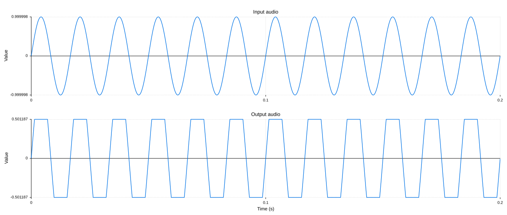

@page TestingYourDspInHart Testing Your DSP in HART

@tableofcontents

# Setting up your project

To set up your project to use HART, see this page: @ref SettingUpYourProjectToUseHART

# Wrapping your algorithm

In order to get HART to play audio through your DSP algorithm, you need to help HART to interface with it. There are two ways of doing this:

1. Providing a function - a light-weight option for simple inline processing
2. Defining a `hart::DSP` subclass - a more structured approach, suitable for complex or reusable processors

Both approaches let HART render audio through your algorithm. You'll get less capabilities with function-based approach, but it's often faster and easier to implement. HART doesn't force you into writing custom subclasses if you just need something simple that can be expressed with a lambda one-liner. You can always start with a lambda-based DSP, and later upgrade it by creating a full-featured `hart::DSP` subclass. If you're testing a more advanced processor (e.g. a plugin or a stateful effect), starting with a custom subclass right away is usually a better idea.

## Using function-based DSP

Providing a function that describes how your audio should be processed is often the quickest way to get started. HART supports three forms of function-based DSP:

1. `SampleType myDspFunction (SampleType value)` - Sample-wise processing
2. `void myDspFunction (AudioBuffer<SampleType>& buffer)` - Block-wise replacing (in-place) processing
3. `void myDspFunction (const AudioBuffer<SampleType>& input, AudioBuffer<SampleType>& output)` - Block-wise non-replacing processing

`SampleType` is the type of your audio samples, typically `float` or `double`. `AudioBuffer` is a HART container for audio data. For more details, see `DSPFunction` documentation. The function can be a lambda, a regular function, or a functor.

### Examples

#### Simple sample-wise function

Handy for very basic DSP transformations. Keep in mind, that with this type of callback, you won't be aware of what channel does this sample come from, or what the current sample rate is.

```cpp
// Uses sample-wise function signature
processAudioWith (
    [] (float x) { return std::tanh (x); },
    "Waveshaper"
    )
    .withInputSignal (SineWave())
    .expectTrue (PeaksBelow (0_dB))
    .process();
```

**Note:** In order to use `processAudioWith (function, label)` helper function, you need to have `HART_DECLARE_ALIASES_FOR_FLOAT` or `HART_DECLARE_ALIASES_FOR_DOUBLE` macro defined at the top of your cpp file. Otherwise, you'll have to use it with a slightly more verbose syntax: `processAudioWith (DSPFunction<SampleType> (function, label))`.

#### Wrapping existing C-style code

If your DSP operates on raw buffers, you can easily wrap it using a block-based function. The `in` and `out` arguments will be `hart::AudioBuffer` references. Among other things, they contain metadata on what sample rate they're supposed to be in, number of channels and frames. See `hart::AudioBuffer` documentation for more details.

```cpp
void myDspFunction (float** inputs, float** outputs, size_t numFrames, double sampleRateHz);

// ...

// Uses block-wise non-replacing function signature
processAudioWith (
    [&] (const auto& in, auto& out)
    {
        myDspFunction (
            (float**) in.getArrayOfReadPointers(),
            out.getArrayOfWritePointers(),
            in.getNumFrames(),
            in.getSampleRateHz()
            );
    },
    "My DSP Function"
    )
    .withInputSignal (SineWave())
    .inStereo()
    .expectFalse (EqualsTo (SineWave()))
    .expectFalse (EqualsTo (Silence()))
    .process();
```

#### Wrapping a JUCE AudioProcessor subclass

You can also use this approach to test existing processors without writing a dedicated wrapper. Frankly speaking, at this point it's best to consider creating a custom `hart::DSP` subclass instead, but it's still possible with functional approach, although a bit clunky.

```cpp
juce::AudioBuffer<float> juceAudioBuffer (1, 1024);
MyJuceAudioProcessor processor;
processor.prepareToPlay (44100.0, 1024);

// Uses block-wise replacing function signature
processAudioWith (
    [&processor] (auto& hartAudioBuffer)
    {
        const auto numFrames = hartAudioBuffer.getNumFrames();
        juceAudioBuffer.setSize (1, numFrames, true, false, true);
        juceAudioBuffer.copyFrom (0, 0, hartAudioBuffer[0], numFrames);
        juce::MidiBuffer dummyMidiBuffer;
        processor.processBlock (juceAudioBuffer, dummyMidiBuffer);
        hartAudioBuffer.copyFrom (0, 0, juceAudioBuffer.getReadPointer (0), numFrames);
    },
    "JUCE processor"
    )
    .withInputSignal (SineWave())
    .inMono()
    .expectFalse (EqualsTo (SineWave()))
    .expectFalse (EqualsTo (Silence()))
    .process();
```

### Using DSPFunction explicitly

Under the hood, `processAudioWith()` wraps your function into a `hart::DSPFunction` object. You can also construct it directly, and use as a regular DSP object:

```cpp
auto polarityFlip = DSPFunction<float> (
    [] (float x) { return -x; },
    "Polarity Flip"
);

processAudioWith (std::move (polarityFlip))
    .withInputSignal (SineWave())
    .expectTrue (EqualsTo (SineWave (hart::pi)))
    .process();
```

Function-based DSPs have limited capabilities: for instance, they won't support setting parameters via `AudioTestBuilder::setValue()`, or parameter automation, but they're a great choice for defining quick inline transformations, without having to create a custom subclass.

If your DSP is more complex (e.g. requires internal state, multiple parameters, or to be re-used across tests), it's often more convenient to define it as a dedicated DSP class, which will be described below.

## Using a DSP class

Making your own custom hart::DSP subclass gives you access to all the HART features. To make it happen, make a subclass of @ref hart::DSP and put your class inside of it. You'll have to implement a few methods for it. A minimal setup can look like this:

```cpp
class MyDSPWrapper :
    public hart::DSP<float, MyDSPWrapper>  // Note the CRTP in the template - it's important!
{
public:
    // Optional, but encouraged to do - for setValue()
    enum Params
    {
        someParamID,
        someOtherParamID
    };

    MyDSPWrapper();

    void prepare (
        double sampleRateHz,
        size_t numInputChannels,
        size_t numOutputChannels,
        size_t maxBlockSizeFrames
        ) override;

    void process (
        const hart::AudioBuffer<float>& input,
        hart::AudioBuffer<float>& output,
        const hart::EnvelopeBuffers& envelopeBuffers,
        hart::ChannelFlags channelsToProcess
        ) override;

    void setValue (int id, double value) override;
    void represent (std::ostream& stream) const override;  // Or just use HART_DEFINE_GENERIC_REPRESENT (MyDSPWrapper)
    bool supportsEnvelopeFor (int id) const override;
    bool supportsChannelLayout (size_t numInputChannels, size_t numOutputChannels) const override;
    virtual bool supportsSampleRate (double sampleRateHz) const override;

private:
    MyActualEffectClass& m_effect;  // Or a unique_ptr, if your underlying class in non-movable
};

```

It may look like a lot, but you probably already have similar methods implemented in your effect, so it won't take too much work. Check the hart::DSP reference for details about each of those methods.

HART supports processing in both ```float``` and ```double``` when it comes to audio data - everything that has to do with audio buffers is templated. Everything that has to do with parameters (like gains, compressor thresholds etc) is always ```double``` - keeps thigs way simpler! 

# Your first test

In your main cpp, or a separate cpp file, declare a test function like this:

```cpp
#include "hart.hpp"

HART_TEST ("My first HART Test")
{
}
```

Now build and run it! You can also use \ref HART_TEST_WITH_TAGS if you want to use tags, like in [Catch2](https://github.com/catchorg/Catch2)! Now let's do something simple:

```cpp
#include "hart.hpp"

HART_TEST ("My first HART Test")
{
    processAudioWith (MyDSPWrapper())  // [1]
        .withInputSignal (SineWave())  // [2]
        .withValue (MyDSPWrapper::someParamID, 6.7)  // [3]
        .expectTrue (PeaksAt (-3_dB))  // [4]
        .process();  // [5]
}
```

It's probably pretty clear what this tests is trying to express, but let's break it down.

## [1] Instantiating your effect

You create your wrapped effect's instance and hand it over to the test host (test runner). You can either move it, or pass a `unique_ptr` to it. In any case the test runner will own an instance of your effect, while it's rendering audio, and then it will spit it back out. To copy, you have to explicitly call `myDSPWrapper.copy()`. If you construct multiple tests in one test case (multiple `process()` calls), you can either instantiate a new DSP every time, or re-use it, as `process()` returns a `unique_ptr` with your used object, after the rendering finishes.  So you can re-use it multiple times, if you do not want to instantiate a new one every time, or want it's state to keep flowing, or want to to domething else with it between the tests.

So, to summarize:

```cpp
// 1. Basic rvalue instantiation - this is the easiest way
processAudioWith (MyDSPWrapper())./*...*/.process()

// 2. Moving a named object
MyDSPWrapper myDSPWrapper;
processAudioWith (std::move (myDSPWrapper))./*...*/.process()

// 3. Copying a copyable object
const MyDSPWrapper myDSPWrapper;
processAudioWith (myDSPWrapper.copy())./*...*/.process()

// 4. Transfering a smart pointer
processAudioWith (std::make_unique<MyDSPWrapper>())./*...*/.process()

// 5. Re-using an object
auto reUseMe = processAudioWith (/*Create it any way you like*/)./*...*/.process()  // Returns a unique_ptr to the used DSP instance
reUseMe = processAudioWith (std::move (reUseMe))./*...*/.process()  // Re-using the DSP instance
reUseMe = processAudioWith (std::move (reUseMe))./*...*/.process()  // Re-using it again
```

## [2] Defining input signal

You feed some audio into your effect, to check what comes out. This is the core purpose of this framework. In the future, I'll probably add support for synths and virtual instruments - I need that too - but audio effects is a priority.

"Signal" is one of the core concepts of this framework. It  can be as simple as a sine wave. It can be something more complex: with a chain of effects with automation envelopes to shape it. Or it can be just a wav file - I know a lot of people just want to play some pre-rendered audio through it, you can do it too, easily! And you can, of course, create your own signals as well, via a simple function (see `hart::SignalFunction`), or by creating a custom `hart::Signal` subclass.

If you ever need to re-use the signal instance, you can get it via `AudioTestBuilder::saveInputSignalTo()`. For example, there are some cases, where you want to put your DSP instance into a signal's DSP chain (yes, you can do it too!), and this way you can eventually get your DSP instance back.

## [3] Setting some values

Obviously, you want to put your effect in some state first, in most cases. In most cases, you just want to set a few fixed values - just chain a few withValue() statements - they will call `hart::DSP::setValue()`` that you've implemented earlier. Of course, you can choose to not do those statements at all, and it will keep your effect in its default state.

If your DSP has internal value smoothing, or needs some time to settle for any other reason, you might want to call `AudioTestBuilder::withWarmUp (timeInSeconds)` as well - it will run the audio through it for requested duration, but will not do any matcher checks (your `expectTrue()`, `assertFalse()` etc - see the next section). And only after that, it will run the test with the matchers.

You can also do something more fancy with the parameters - think automation curves like in DAWs, or the LFOs. You can do this to in HART - more on this later! Check Envelopes section of this reference for details.

## [4] Checking the audio produced by your effect

This is what this framework is for, after all. `PeaksAt` is something called "Matcher" (may ring a bell, if you've ever used Catch2). If receives audio from your effect's output and checks it. This one, as the name implies, checks if the signal peaks at 3dB. By the way, you get a bunch of handy constants and literals for better readability, like `_dB` or `_kHz` - you're welcome to use them. See `hart_units.hpp` header for the full list.

Other matchers can, for example, compare your output with some other signal or a wav file. And they're passed in as objects or functions - it means you make your own and use them, just like the stock ones. So, if you need, say, check LUFS values, inter-sample peaks, or check something fancy in frequency domain, just subclass a Matcher, and pass it to the test runner. And if you want to write a simple lambda instead of creating a custom subclass, you can do it too - check `hart::MatcherFunction` for details.

You can do two levels of assertions: "expect" and "assert". Like in other test frameworks, "assert" will stop the test immediately if it fails, but "expect" will report the failure and carry on with other tests. And there are inverted versions for both, so you get:
    * `expectTrue()`
    * `expectFalse()`
    * `assertTrue()`
    * `assertFalse()`

You can have as many assertions/expectations as you want in a single test - just keep chaining them together. They will be checked in that order, whenever possible. However, some matchers need to wait for the full signal to be generated (like `PeaksAt`), while others can work on block-by-block basis (like `EqualsTo`), so the order is not guaranteed.

You also have `HART_ASSERT_TRUE()` and `HART_EXPECT_TRUE()` for trivial non-audio checks, in case you need them. But you shoudn't use HART for testing everything - use it for audio tests, and stick with Google Test (gtest) or Catch2 for everything else.

## [5] Run the test

You should always call it after your setup steps. Everything between steps [1] and [5] can come in any order, these are just some lightweight set up calls. Calling process launches the test, processes audio block by block, and runs the checks. If any of these fails, you'll get a readable description of what went wrong.

See `AudioTestBuilder` class documentation for the full list of options you can set.

# Setting up the audio

What about the sample rate? Or the block size? I'm glad you asked! We didn't set those up earlier, because we were using a default configuration. If you're looking for something specific in a given test case, you can change those like so:

```cpp
hart::processAudioWith (MyDSPWrapper())
    .withSampleRate (48_kHz)
    .withBlockSize (64)
    .withDuration (325.5_ms)
    .withInputChannels (5)
    .withOutputChannels (10)

    // Set your input signal
    // Set effect's values
    // Set your assertions

    .process();
```

You can skip any parameters that don't care about (keeping them at their default values), and only set the specific ones. For more details, check @ref hart::AudioTestBuilder methods.

HART also gives you an ability to override the defaults globally via respective CLI options. So you can, for instance, write tests once, without setting `withSampleRate (someSampleRateHz)` explicitly, and then run the test suite a few times with different `--sample-rate` options, ensuring all the tests pass at desired sample rates, without over-complicating test case logic by wrapping them in a bunch of `for`-loops. Here's all you need to know about those parameters:

Parameter       | Default Value | CLI Default Override | Test-local override
----------------|---------------|----------------------|----------------------
Sample Rate     | 44100 Hz      | `--sample-rate`      | `withSampleRate()`
Block Size      | 1024 frames   | `--block-size`       | `withBlockSize()`
Duration        | 100 ms        | `--render-duration`  | `withDuration()`
Input Channels  | 1 (mono)      | `--input-channels`   | `withInputChannels()`, `withMonoInput()`, `withStereoInput()`, `inMono()`, `inStereo()`
Output Channels | 1 (mono)      | `--output-channels`  | `withInOutputChannels()`, `withMonoOutput()`, `withStereoOutput()`, `inMono()`, `inStereo()`

# Logging the audio

If your test fails, you might want to check what was the output audio. You can tell HART to output the audio easily:

```cpp
processAudioWith (MyDSPWrapper())
    // Set up everything
    .saveOutputTo ("my_test_output.wav")
    .process();
```

By default, they will save the audio only when any of the checks fail, but you can tell them to save audio regardless of the result via the second argument - handy for generating data for regression tests. See `AudioTestBuilder::saveOutputTo()` and `hart::Save`. Supported formats are PCM at 16, 24 and 32 bits and float at 32 bit. Default is PCM24. You can use absolute or relative paths. For relative paths, set the `--data-root-path` CLI parameter to wherever you want HART to save them.

If you want to avoid accessing file system, you can output audio to a buffer instead:

```cpp
hart::AudioBuffer<float> myBuffer;
processAudioWith (MyDSPWrapper())
    // Set up everything
    .saveOutputTo (myBuffer)  // Takes a reference to your buffer, or a sink fuction
    .process();

// You can even re-use it as a reference audio signal
processAudioWith (MyDSPWrapper())
    .withInputSignal (AudioBufferSignal (myBuffer))  // Your buffered audio is a Signal now!
    // ...
    .process();
```

You can also log your audio as plots of your input and output waveform with @ref hart::AudioTestBuilder::savePlotTo():

```cpp
processAudioWith (HardClip (-6_dB))
    .withInputSignal (SineWave (60_Hz))
    .withDuration (200_ms)
    .savePlotTo ("Clipper.svg")
    .process();
```

Similar to methods for saving wav files, second argument can be used to set when do you want to save it - always or when the test fails. This will create an SVG file like this:



# Playing the pre-rendered audio

I assume most people just want to pre-render some audio and play it through your effect. While it's absolutely possible with HART, I encourage you to explore signal generation with HART before you fall on your old habit of using pre-rendered wav's. But here's how you do it:

```cpp
processAudioWith (MyDSPWrapper())
    .withInputSignal (WavFile ("my_test_input.wav"))
    // Your other set up
    .expectTrue (EqualsTo (WavFile ("my_test_reference_output.wav")))
    .process();
```

Done! See @ref hart::WavFile for the details. You might also want to put the @ref HART_REQUIRES_DATA_PATH_ARG macro at the beginning of test cases that use relative path - it will remind you to pass the respective CLI argument of you forgot to do so.

# Generating test signals

HART is designed to create complex signals by expressing them with the code. This way you can avoid fumbling with test generators in your DAW and hoarding a ton of wav files as your input test signals.

You've already seen a few of the signals - `Silence`, `SineWave` and `WavFile`. There's more of those, of course, like `SineSweep` or `WhiteNoise`, and more will come in the future. But what's even better is that you can shape them before feeding them into your effect, or before comparing your effect's output to them.

First, you can add effects to them. For example, if you want to have a `SineWave` at -3dB, you can do it like so: `SineWave() >> GainDb (-3_dB)`. Let's actually do something more complex:

```cpp
processAudioWith (MyDSPWrapper())
    .withInputSignal (SineWave (3.5_kHz, halfPi) >> GainDb (+2.5_dB) >> HardClip (-3_dB))
    // ...
    .process();

```

At first we have a sine wave at 3.5 kHz, with starting phase at &pi;/2 radians. By the way, all the previous one were just created with default frequency, which is 1 kHz. It always outputs the signal at 0 dB sample peak level, and, like most other signals, you cannot set its level in constructor - to do so, you just throw a gain effect after it. Which is exactly what is happening here. `GainDb` is one of the DSP effects built into HART framework. By the way, it's also a `hart::DSP` subclass just like MyDSPWrapper we've just defined, so you can use them interchangeably! And after that, it gets clipped at -3 dB, turning it into a somewhat square-ish shape.

If you're curious what's going on behind the fancy syntax: hart::Signal objects can store a sequence of DSP effects inside of them. When `process()` is called, the y initialize the whole chain, generate audio, and play it through their DSP
chain, at whatever sample rate, block size et cetera you're set your audio test to. Signal is the host here, it owns, runs and manages those effect instances. Effects can not be attached to each other - they need some Signal source to own them. And Signal can be a lot of things, like a WavFile, for instance. The order of the effects is guaranteed to be preserved: whatever gets added first, receives the audio first.

Signals can take any DSP instances, including your own effect. So those two pieces of code produce the same audio:

```cpp
// [1]
processAudioWith (MyDSPWrapper())
    .withInputSignal (SineWave())
    // ...
    .process();

// [2]
processAudioWith (GainDb (0_dB))
    .withInputSignal (SineWave() >> MyDSPWrapper())
    // ...
    .process();
```

Although [1] is, of course, a preferred approach, and it gives you an easier interface to set up your effect's values. But you have multiple DSP algorithms to test, you can easily chain them together in any order, taking some inspiration form example [2].

And you can also make your own little utility DSP classes to shape the signals - at this point, you already know how to subclass hart::DSP.

# Parameter automation envelopes

But wait, there's more! Remember when we set sine gave's level to 2.5 dB in the previous chapter? It was a fixed value. We can change in time. Let's say, we want the gain to start at -3 dB, but then after 10 ms jump to -10 dB, stay there for 50 ms, and then slowly crawl to -1 dB in an s-curved manner for 100 ms.

Here's how you do it. To express this curve, you can do something like this:

```cpp
const auto myGainEnvelope = SegmentedEnvelope (decibelsToRatio (-3_dB))
    .hold (10_ms)
    .rampTo (decibelsToRatio (-10_dB), 5_ms)
    .hold (50_ms)
    .rampTo (decibelsToRatio (-1_dB), 100_ms, SegmentedEnvelope::Shape::sCurve);
```

Notice how it's not attached to any DSP unit or host yet, it's just a lightweight object that stores some data about what how some value should change in time. It doesn't even have to know anything about the effect, signal, or your audio test set up like sample rate or channel number. It supports a few different shapes of ramp transitions, like linear, exponential or s-curve.

And now, you can attach it to your (or any other) effect:

```cpp
// [1] - Just a fixed value
const myEffect1 = MyDSPWrapper().withValue (MyDSPWrapper::someParamID, 2.5_dB);

// [2] - Same parameter, but changes in time
const myEffect1 = MyDSPWrapper().withEnvelope (MyDSPWrapper::someParamID, myGainEnvelope);
```

Now pause and try to apply it as Gain for a SineWave. Note: if you're doing slow gain ramps and want a specific curve, you might want to use GainLinear effect instead of GainDB. Applying a linear curve to a value in decibels is awkward, so you won't get a proper linear curve with GainDb. But if you don't care about it, you can just use either of those.

Now, if you want to feed the envelopes into your own processor, you probably need to know how to support them properly. First, the host of this DSP will figure out the value rendering part, you won't have to worry about it. In each `process()` callback you'll get a container with envelope curves together with your audio buffers. It's a hash map - key is your parameter's id, and value is a container with pre-rendered values for this parameter, same length as audio buffers. Did I mention it's a sample accurate automation? It's a sample accurate automation! So you can fetch it an use it like so:

```cpp
void process (const AudioBuffer<SampleType>& input, AudioBuffer<SampleType>& output, const EnvelopeBuffers& envelopeBuffers) override
{
    const bool hasGainEnvelope = envelopeBuffers.contains (someParamID); // [1]

    if (hasGainEnvelope)
    {
        std::vector<double>& someParamEnvelopeValues = envelopeBuffers[someParamID];
        const double someLazyParamValue = someParamEnvelopeValues[0];  // [2]

        for (size_t channel = 0; channel < input.getNumChannels(); ++channel)
        {
            for (size_t frame = 0; frame < input.getNumFrames(); ++frame)
            {
                const double someParamValue = someParamEnvelopeValues[frame]; // [3]
                // Do something with it
                // ...
            }
        }
    }

    else
    {
        const double someParamValue = m_myFixedValue;
        // Render as a fixed value
        // ...
    }
}

```

If there's no envelope attached to your DSP, `envelopeBuffers` will have no record of, so you can check it like in [1]. You can treat it like a block-accurate automation and grab just one value (first one like in [2], or mean, max or whatever), like it's typically done in most audio plugins. Or you can use it properly like in [3], potentially having a different param value for every frame (sample) of audio. Obviously, if you're merely implementing `process()` for testing your effect, you must mirror what your underlying effect already does.

There's also a `supportsEnvelopeFor()` callback that will get triggered by the host, you can return false for the parameter ids that you don't want to support envelopes for, and you won't get `envelopeBuffers` for those.

# LFOs

It's also possible to use @ref hart::Signal and an envelope parameter. For example, automating gain with a SineWave, like an LFO. It's not implemented yet, but if you want to beat me to it, just subclass hart::Envelope and make your own!

# Generating audio for regression and acceptance tests

Obviously, if you want to compare your effect's output to pre-recorded wav's, you need those wav files first. You can do it with just regular test cases, of course, but HART has special ones just for this. Use @ref HART_GENERATE() or @ref HART_GENERATE_WITH_TAGS() instead of usual tests. Under the hood, they're pretty much the same as regular test cases, but will help to keep "test" and "generate" tasks separate, of you choose to do them in the same target (project).

To run tasks defined with those macros run your HART test binary with a `--run-generators` (or `-g`) flag. It will skip all tests and run the generators. Without this flag, it will run only tests, and skip the generators.

# Command line interface

If you run your test binary with a `--help` CLI argument, it will tell you everything you need to know. Things you can do with it:

* Provide a set of tags, to only run the tasks with those tags

* Override global defaults for sample rate, block size and other audio render parameters

* Set data root path for your relative file paths (like wav files)

* Set random seed for everything random. By the way, everything random is guaranteed to be deterministin in HART!

* Set number of decimal points for various values (like decibels, seconds etc)

* Choose to run just tests or just generators

* Ask HART to shuffle your test cases

Someday there will be option for tags and threaded runs as well. Hopefully!

# Some more test examples

Check `tests` directory for the examples. Is there a better way to document an automated test framework, than to read the tests used by it to test itself?
